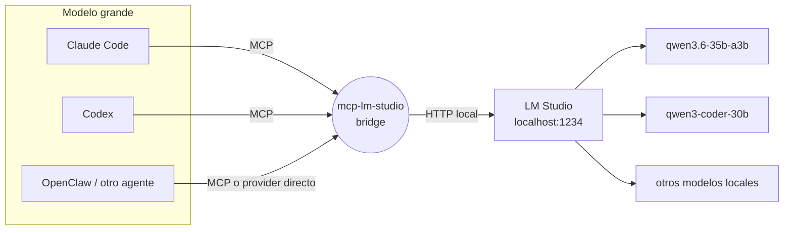

# llm-Intern

[](LICENSE)
[](package.json)
[](https://modelcontextprotocol.io/)


Servidor MCP que expone un modelo local de [LM Studio](https://lmstudio.ai/) como
tools de **Claude Code**, **Codex** y **OpenClaw**: "el intern", delegación de
trabajo mecánico o masivo a un modelo que corre gratis en tu propia máquina, para no
gastar cuota del modelo grande en tareas que no la necesitan.

> **Sobre Bionic:** el código es compatible (es un derivado de LM Studio y comparte
> todo), pero **hoy no lo recomiendo** — tiene un bug que impide cargar modelos
> grandes. Detalle y evidencia en [Hosts compatibles](#hosts-compatibles-lm-studio-y-bionic).

En Claude Code / Codex el intern es la **excepción** (el modelo grande es el doer por
defecto). En OpenClaw el agente `main` lo usa **al revés**: es supervisor y **exprime
al intern como doer por defecto**, interviniendo solo para corregir o terminar. Ver
[`docs/openclaw-setup.md`](docs/openclaw-setup.md).

No es un reemplazo del modelo grande. Es un ayudante barato para lo mecánico, con
reglas claras de cuándo conviene usarlo y cuándo no.



## Por qué

El modelo grande (Claude, GPT) cobra por token y razona mejor. El modelo local
(LM Studio) es gratis e ilimitado, pero rinde peor en razonamiento complejo. Este
repo no es solo el bridge técnico — es también el **protocolo de decisión** (cuándo
delegar, con qué modelo, cómo medir si valió la pena) para que la delegación tenga
criterio y no sea "mandarle cualquier cosa al modelo chico". Ver [`MODELS.md`](MODELS.md).

## Qué incluye

- **`src/index.ts`** — el servidor MCP (Node/TypeScript). Seis tools, organizadas en **dos tiers** (`subagent` para trabajo autónomo con tools, `intern` para delegación mecánica de texto — ver [MODELS.md](MODELS.md)):
  - `lm_studio_generate` — texto/código sin herramientas, todo el contexto va en el prompt. Tier intern. Soporta `response_schema` (JSON Schema) para forzar salida estructurada.
  - `lm_studio_agent` — el modelo local con acceso real a tus otros MCPs (`~/.lmstudio/mcp.json`), loop de agente completo. Tier subagent. Devuelve `tool_trace` (qué tool se llamó, con qué args, qué devolvió) para auditar cada dato de la respuesta, y soporta `response_schema` para forzar el formato final. Ver [`docs/audit-tasks-pattern.md`](docs/audit-tasks-pattern.md) para el patrón de uso en tareas de extracción/auditoría.
  - `lm_studio_capacity` — techo de memoria del host, modelos residentes y margen libre. Llamalo **antes** de cargar un segundo modelo; con `candidate_model` te dice si ese modelo entra.
  - `lm_studio_load_model` — carga un modelo concreto. Con `exclusive:true` (default) descarga los demás y mata de raíz el "modelo equivocado cargado"; con `exclusive:false` **suma** el modelo a los residentes para correr varios a la vez, verificando antes que entre en memoria.
  - `lm_studio_list_models` — qué hay descargado/cargado en LM Studio, con el `tier=` y el contexto de cada uno.
  - `lm_studio_list_mcp_servers` — qué MCPs puede usar `lm_studio_agent`.
- **`.claude/skills/intern/`** — Skill de Claude Code (`/intern`) con el protocolo completo.
- **`templates/`** — snippets para pegar en tu `~/.claude/CLAUDE.md`, `~/.codex/AGENTS.md` y el `AGENTS.md` del `main` de OpenClaw (delegación automática, sin invocar el skill a mano), más `mcp.json` de ejemplo, el bloque MCP de OpenClaw y una plantilla de log de uso.
- **`MODELS.md`** — qué modelos usar para qué tipo de tarea, con los modelos que ya pasaron por este setup.
- **`docs/`** — guías de instalación por herramienta (Claude Code, Codex, OpenClaw, LM Studio) + [patrón de auditoría/extracción](docs/audit-tasks-pattern.md) + [roadmap](docs/roadmap.md) de mejoras en diseño.

## Integraciones

| Herramienta | Cómo se conecta | Guía |
|---|---|---|
| **Claude Code** | `claude mcp add` + Skill opcional | [`docs/claude-code-setup.md`](docs/claude-code-setup.md) |
| **Codex** | `[mcp_servers.lm-studio]` en `~/.codex/config.toml` | [`docs/codex-setup.md`](docs/codex-setup.md) |
| **OpenClaw** | MCP tool en `openclaw.json` + protocolo intern-first (agente `main` como supervisor) | [`docs/openclaw-setup.md`](docs/openclaw-setup.md) |

## Hosts compatibles: LM Studio y Bionic

**Host recomendado: LM Studio.**

**Bionic** (Element Labs) es un derivado de LM Studio y a nivel de integración es un
**drop-in** — el bridge funciona sin cambiar nada. Verificado sobre una instalación
con Bionic y sin LM Studio:

| | LM Studio | Bionic |
|---|---|---|
| Home / config | `~/.lmstudio` | **el mismo** (`~/.lmstudio`, más un `~/.lmstudio-home-pointer`) |
| Toolbox de `lm_studio_agent` | `~/.lmstudio/mcp.json` | el mismo |
| Puerto por defecto | `1234` | el mismo |
| API OpenAI-compat | `/v1/...` | la misma |
| API nativa (estado de modelos) | `/api/v0/models` | la misma |
| CLI | `lms` | el mismo binario (idéntico SHA al que trae en su bundle) |

Si tu instalación no dejó `~/.lmstudio/bin/lms` linkeado, el bridge también busca
el `lms` dentro del bundle de la app. Podés forzar la ruta con `LMS_PATH`.

### Bionic 1.0.6: no carga modelos grandes (bug de AutoFit)

**Con Bionic 1.0.6+5, un modelo de ~20 GB (MoE 35B, 4-bit MLX) resultó imposible de
cargar.** El error:

```
Error: MLX AutoFit selected a context length of 183296,
       below the required minimum of 2014607.
```

Ese "mínimo requerido" es **imposible**: 2.014.607 de contexto para un modelo cuyo
máximo declarado son 262.144. Y es **errático** — en otra corrida, con la misma
config, pidió `193825`.

No responde a **ningún** input. Probado y descartado uno por uno:

| Intento | Resultado |
|---|---|
| `--context-length` 262144 / 131072 / **4096** | idéntico error, mismos números |
| `--parallel` 4 / 3 / 1 | idéntico |
| Editar `contextLength` del preset (262144 → 183296 → 65536) | idéntico |
| Bajar `modelLoadingGuardrails` de `medium` a `low` | idéntico |
| Reiniciar la app (para que reelea la config) | idéntico |
| RAM libre al 81 % de 48 GB, nada más cargado | idéntico |

**La prueba de que es de Bionic y no del hardware:** en la misma máquina, con la
misma RAM, el mismo `~/.lmstudio` y el mismo preset, **LM Studio carga ese modelo
sin problema — justamente con contexto 183296**, el valor que AutoFit proponía y que
Bionic rechazaba contra su mínimo imposible.

Detalle secundario, útil si aparece un caso parecido: los modelos de **visión**
(`type: vlm`) no admiten cuantización de KV cache, que es la palanca que reduciría la
memoria — comprobado en los presets (un modelo text-only equivalente sí la tiene
activada). Eso agrava el consumo, pero no explica el mínimo imposible.

Conclusión: el bridge queda compatible con Bionic por si lo arreglan, pero **hoy
usá LM Studio** si vas a correr modelos grandes.

### Caveat importante: LM Link (modelos en otras máquinas)

Si tenés **LM Link** activo, un modelo cargado en OTRO equipo aparece en este host
como `state: "loaded"`, y `/api/v0/models` **no dice en qué máquina está**. Dos
consecuencias:

- **El intern puede estar corriendo en otra máquina** sin que se note desde la API.
  Para ver dónde: `lms ps` (columna DEVICE) o `lms link status`.
- **`lm_studio_load_model` con `exclusive: true` nunca descarga instancias de otros
  equipos** — un barrido masivo podría apagar el modelo del que depende un agente
  allá. Si de verdad querés incluirlas, pasá `include_remote: true` a conciencia.

Además, con un *preferred device* configurado, `lms load` carga en **ese** equipo,
no necesariamente en el tuyo — así que `exclusive` garantiza exclusividad donde
efectivamente cargue, no "en mi laptop".

## Quickstart

Prerrequisito: [LM Studio](https://lmstudio.ai/) o [Bionic](https://elementlabs.ai/)
instalado, con al menos un modelo descargado y el servidor local activo
(`http://localhost:1234`). Ver [`docs/lm-studio-setup.md`](docs/lm-studio-setup.md).

```bash
git clone https://github.com/fvanlookeren-bit/llm-Intern.git
cd llm-Intern
./install.sh
```

El instalador compila el bridge y, si tenés el CLI `claude`, te ofrece registrarlo.
Para el resto del setup por herramienta:

- [`docs/claude-code-setup.md`](docs/claude-code-setup.md)
- [`docs/codex-setup.md`](docs/codex-setup.md)
- [`docs/openclaw-setup.md`](docs/openclaw-setup.md) — protocolo intern-first para el agente `main`

Verificar que todo funciona:

```bash
node smoke-test.mjs
```

## Cómo se usa

Una vez instalado, en cualquier sesión de Claude Code, Codex u OpenClaw:

> "Usá el intern para resumir estos 40 archivos de log."

El modelo grande delega la tarea al MCP `lm-studio`, que corre local contra LM
Studio. Con las instrucciones de `templates/CLAUDE.snippet.md` /
`templates/AGENTS.snippet.md` / `templates/openclaw.snippet.md` instaladas, la
delegación también pasa **proactivamente** para tareas mecánicas obvias, sin que lo
pidas cada vez.

## Modelos probados y recomendados

Resumen — tabla completa y veredictos en [`MODELS.md`](MODELS.md):

| Modelo | Uso recomendado |
|---|---|
| `qwen/qwen3.6-35b-a3b` | ✅ Default — mecánico/un paso, rápido |
| `qwen/qwen3-coder-30b` | ✅ Código, solo tareas acotadas (no edición multi-archivo grande) |
| `qwen/qwen3.6-27b` / `gemma-4-31b` | ✅ Complejidad moderada, dense, más lento |
| `google/gemma-4-26b-a4b-qat` | ⚠️ Razonador — necesita `max_tokens` generoso o thinking off |
| `qwen/qwen3-4b-2507` | ⚠️ Solo tareas triviales |
| `liquid/lfm2.5-1.2b` | ❌ Alucina en preguntas factuales — solo transformación de texto pura |

## OpenClaw — el intern para ahorrar tokens del `main`

En [OpenClaw](https://openclaw.ai) el agente `main` suele correr en un modelo de
pago (GPT/Claude). Ese modelo es caro por token y no hace falta gastarlo en trabajo
mecánico. La integración del intern invierte el rol: **`main` es supervisor y el
intern es el doer por defecto.**

**El ahorro concreto:** en un ciclo intern-first, el modelo de pago no *produce* el
grueso — solo **planifica, revisa y corrige**. El volumen (borradores, variantes,
transformaciones, resúmenes, boilerplate) lo genera el modelo local, gratis. El
modelo de pago gasta unos cientos de tokens de supervisión en lugar de los miles que
costaría generar todo él mismo, y esos tokens locales tienen costo cero.

```
Sin intern:   main (pago) ─────────── genera 20 variantes ──────────►  ~miles de tokens de pago
Con intern:   main (pago) ─ planifica ─► intern (local, gratis) genera ─► main revisa/corrige
                              (cientos de tokens de pago)      (0 tokens de pago)   (cientos)
```

**Cómo se integra** (detalle en [`docs/openclaw-setup.md`](docs/openclaw-setup.md)):

1. Compilás el bridge (`npm run build`) y registrás el server `lm-studio` en
   `~/.openclaw/openclaw.json` → `mcp.servers` (bloque listo en
   [`templates/openclaw-mcp.snippet.json`](templates/openclaw-mcp.snippet.json)).
   OpenClaw expone las tools MCP por **tool-search**, así que el `main` descubre el
   intern por nombre cuando lo necesita.
2. Instalás el protocolo intern-first de
   [`templates/openclaw.snippet.md`](templates/openclaw.snippet.md) en el `AGENTS.md`
   del `main`. **Ojo:** no basta con pegarlo al final — hay que darle prioridad
   estructural cerca del inicio del archivo, o el modelo se ancla en sus directivas
   de arranque y sigue haciéndolo todo él mismo (ver la nota del paso 4 de la guía).

**Ejemplo real (verificado):** al pedirle al `main` "generá 20 subject lines para una
promo", con el protocolo bien instalado el `main` llama a `lm_studio_generate` (el
modelo local devuelve las variantes en ~8 s), después filtra y entrega las finales,
y registra el uso en el log — todo sin gastar tokens de pago en la generación.

## Configuración

Variables de entorno opcionales (todas tienen default):

| Variable | Default | Qué hace |
|---|---|---|
| `LM_STUDIO_BASE_URL` | `http://localhost:1234/v1` | Endpoint OpenAI-compatible de LM Studio |
| `LM_STUDIO_DEFAULT_MODEL` | `qwen/qwen3.6-35b-a3b` | Modelo que se JIT-carga si no hay ninguno ya cargado |
| `LM_STUDIO_SUBAGENT_MODELS` | `qwen3.8-27b-mlx` | Lista separada por comas de los modelos del tier **subagent** — los que se consideran aptos para `lm_studio_agent` (loop autónomo con tools). El resto queda en tier `intern`. Un valor vacío (`""`) desactiva el tier subagent. Es curado a propósito: el host reporta `tool_use` para todos los modelos no-embedding, así que esa capability no sirve para decidirlo |
| `LM_STUDIO_TTL_SECONDS` | `600` | **Auto-unload.** Segundos de inactividad tras los cuales el host descarga un modelo que levantó el bridge. Se manda en cada request, así que todo modelo que el bridge JIT-cargue queda con auto-descarga sin que nadie se acuerde de liberarlo. Es un TTL de inactividad (cada request lo reinicia), así que una tanda seguida no paga recargas. `0` lo desactiva |
| `INTERN_ACTIVITY_LOG` | `~/.lmstudio/intern-activity.jsonl` | Log de actividad del intern (ver abajo). `off` lo desactiva |
| `INTERN_MCP_CONFIG` | `~/.lmstudio/mcp.json` | Toolbox de `lm_studio_agent`. Apuntalo a un archivo curado para dar al intern un subconjunto acotado de MCPs (útil cuando lanza el bridge otro host, p.ej. OpenClaw) |

## Limitaciones conocidas (de LM Studio, no de este bridge)

- **Desactivar el "thinking" vía API no es confiable** — hay que editar el Prompt
  Template del modelo en la app. Ver [`docs/lm-studio-setup.md`](docs/lm-studio-setup.md#desactivar-el-thinking).
- `lm_studio_agent` razona peor que el modelo grande sobre cuándo/cómo usar cada
  tool — verificá el resultado, no lo asumas correcto.

## Ver qué está haciendo el intern

En Claude Code y Codex cada tool MCP aparece con su nombre, así que ves
`lm_studio_generate` en la UI cuando se delega. **En OpenClaw no**: con
`toolSearch` activo (lo normal si tenés muchos MCPs), las tools se invocan a
través de un dispatcher genérico, y en la UI todo figura como `tool_call` — el
intern trabaja pero no se distingue del resto.

Por eso el bridge escribe su propio **log de actividad**, una línea JSON por
delegación, independiente del host:

```bash
./bin/intern-watch        # en vivo (tail -f), formateado
./bin/intern-watch 30     # las últimas 30 y salir
```

```
23:33:02  OK   generate       4.6s  qwen3.6-35b-a3b   Decí solo OK
23:33:09  OK   agent          6.9s  qwen3.6-35b-a3b   [1 tool(s): filesystem__list_directory]  Listá archivos en…
23:40:00  ERR  agent         48.2s  qwen3-coder-30b   3 tool-error(s)  sin respuesta final tras 8 iteraciones  editar 2 TSX
```

Registra tool, modelo, duración, éxito/error, qué MCP tools usó el intern y un
recorte del prompt (160 chars — es un registro de actividad, no de
transcripciones). Ruta por defecto `~/.lmstudio/intern-activity.jsonl`,
configurable con `INTERN_ACTIVITY_LOG`; `INTERN_ACTIVITY_LOG=off` lo desactiva.
Si el archivo no se puede escribir, se ignora en silencio — la observabilidad
nunca tumba una delegación.

Es complementario al log de scoring manual
([`templates/intern-usage-log.template.md`](templates/intern-usage-log.template.md)):
este es automático y dice *qué pasó*; aquel es tu juicio de *qué tan bien salió*.

## Licencia

MIT — ver [`LICENSE`](LICENSE).
